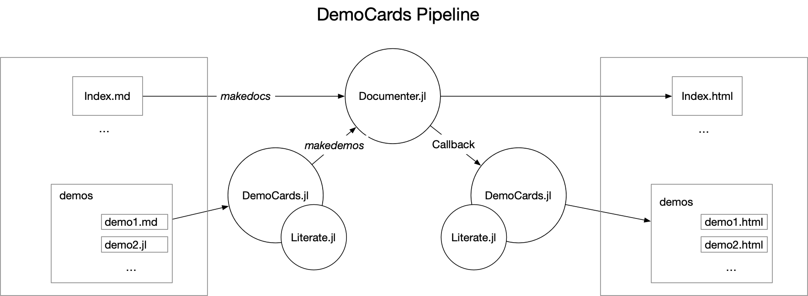

# DemoCards

| **Documentation**                                                               | **Build Status**                                                                                |
|:-------------------------------------------------------------------------------:|:-----------------------------------------------------------------------------------------------:|
| [![][docs-stable-img]][docs-stable-url] [![][docs-dev-img]][docs-dev-url] | [![][action-img]][action-url] [![][pkgeval-img]][pkgeval-url] [![][codecov-img]][codecov-url] |

This package is used to *dynamically* generate a demo page and integrate with [Documenter.jl](https://github.com/JuliaDocs/Documenter.jl).

_Let's focus on writing demos_

## Overview

* a plugin package to `Documenter.jl` to manage all your demos.
* folder structure is the demo structure.
* minimal configuration.
* CI friendly
* support demos in markdown and julia format.



The philosophy of DemoCards is "folder structure is the structure of demos"; organizing folders and files in
the a structural way, then `DemoCards.jl` will help manage how you navigate through the pages.

```text
examples
├── part1
│   ├── assets
│   ├── demo_1.md
│   ├── demo_2.md
│   └── demo_3.md
└── part2
    ├── demo_4.jl
    └── demo_5.jl
```

DemoCards would understand it in the following way:

```text
# Examples
  ## Part1
    demo_1.md
    demo_2.md
    demo_3.md
  ## Part2
    demo_4.jl
    demo_5.jl
```

Read the [Quick Start](https://juliadocs.github.io/DemoCards.jl/stable/quickstart/) for more instructions.

## Examples

| repo | theme |
| :---- | :---- |
| [AlgebraOfGraphics.jl](http://juliaplots.org/AlgebraOfGraphics.jl/dev/gallery/) | [![][theme-bulmagrid-img]][theme-bulmagrid] |
| [Augmentor.jl](https://evizero.github.io/Augmentor.jl/dev/operations/) | [![][theme-grid-img]][theme-grid] |
| [Bokeh.jl](https://cjdoris.github.io/Bokeh.jl/dev/gallery/) | [![][theme-bokehlist-img]][theme-bokehlist] |
| [FractionalDiffEq.jl](https://scifracx.org/FractionalDiffEq.jl/dev/ChaosGallery/) | [![][theme-bulmagrid-img]][theme-bulmagrid] |
| [LeetCode.jl](https://cn.julialang.org/LeetCode.jl/dev/) | [![][theme-none-img]][theme-none] |
| [Images.jl](https://juliaimages.org/latest/examples/) | [![][theme-grid-img]][theme-grid] |
| [ReinforcementLearning.jl](https://juliareinforcementlearning.org/docs/experiments/) | [![][theme-grid-img]][theme-grid] |
| [Plots.jl](https://docs.juliaplots.org/dev/user_gallery/) | [![][theme-bulmagrid-img]][theme-bulmagrid] |

## Caveat Emptor

The use of this package heavily relies on [Documenter.jl](https://github.com/JuliaDocs/Documenter.jl),
[Literate.jl](https://github.com/fredrikekre/Literate.jl), [Mustache.jl](https://github.com/jverzani/Mustache.jl)
and others. Unfortunately, I'm not a contributor of any. This package also uses a lot of Regex, which I know little.

The initial purpose of this package is to set up the [demo page](https://juliaimages.org/latest/examples) of JuliaImages.
I'm not sure how broadly this package suits the need of others, but I'd like to accept any issues/PRs on improving the usage experience.


[docs-dev-img]: https://img.shields.io/badge/docs-dev-blue.svg
[docs-dev-url]: https://juliadocs.github.io/DemoCards.jl/dev

[docs-stable-img]: https://img.shields.io/badge/docs-stable-blue.svg
[docs-stable-url]: https://juliadocs.github.io/DemoCards.jl/stable

[action-img]: https://github.com/JuliaDocs/DemoCards.jl/workflows/Unit%20test/badge.svg
[action-url]: https://github.com/JuliaDocs/DemoCards.jl/actions

[codecov-img]: https://codecov.io/gh/JuliaDocs/DemoCards.jl/branch/master/graph/badge.svg
[codecov-url]: https://codecov.io/gh/JuliaDocs/DemoCards.jl

[pkgeval-img]: https://juliaci.github.io/NanosoldierReports/pkgeval_badges/D/DemoCards.svg
[pkgeval-url]: https://juliaci.github.io/NanosoldierReports/pkgeval_badges/report.html


[theme-bulmagrid-img]: https://img.shields.io/badge/theme-bulmagrid-blue.svg
[theme-grid-img]: https://img.shields.io/badge/theme-grid-blue.svg
[theme-list-img]: https://img.shields.io/badge/theme-list-blue.svg
[theme-bokehlist-img]: https://img.shields.io/badge/theme-bokehlist-blue.svg
[theme-none-img]: https://img.shields.io/badge/theme-none-blue.svg

[theme-bulmagrid]: https://juliadocs.github.io/DemoCards.jl/stable/bulmagrid/
[theme-grid]: https://juliadocs.github.io/DemoCards.jl/stable/grid/
[theme-list]: https://juliadocs.github.io/DemoCards.jl/stable/list/
[theme-bokehlist]: https://juliadocs.github.io/DemoCards.jl/stable/bokehlist/
[theme-none]: https://juliadocs.github.io/DemoCards.jl/stable/themeless/markdown/item1/
