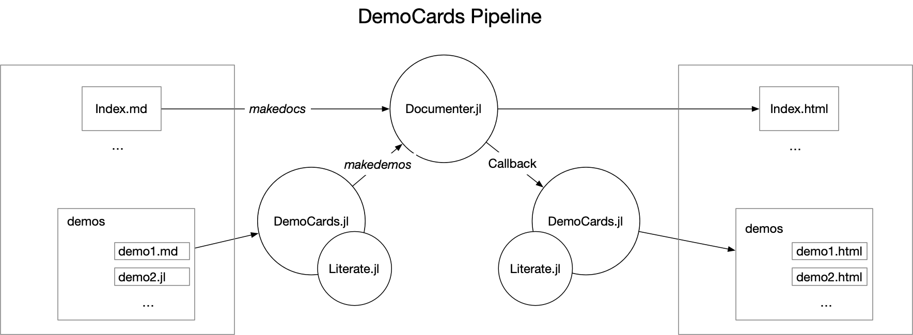

# [Quick Start](@id quickstart)

This section describes how you can set up your demos easily in _five lines of codes_.

## Manage your demo files

The rules of demo management are super simple:

* you need one demo page (folder) to hold all the demo files
* a demo page has several demo sections (subfolders)
* a demo section either
    * has other demo sections as nested subsections, or,
    * has the demo files (`.md`, `.jl`)

In the following example:

* we have one demo page: `"quickstart"` ---> The current page you're looking at
* `"quickstart"` has one demo section: `"usage example"`
* `"usage example"` has two demo subsections: `"basics"` and `"julia_demos"`
  * `"basics"` section holds all markdown demos
  * `"julia_demos"` section holds all julia demos
* `"assets"` folders are ignored by `DemoCards.jl`
* `"index.md"` is where all demo cards are organized in (aka page template)
* `"config.json"` are configuration files (there are many of them!)

```text
docs/quickstart
├── config.json
├── index.md
└── usage_example
    ├── basics
    │   ├── assets
    │   ├── config.json
    │   ├── configure_card.md
    │   ├── configure_sec_and_page.md
    │   ├── hidden_card.jl
    │   ├── hide_your_card_from_index.md
    │   └── simple_markdown_demo.md
    ├── config.json
    └── julia_demos
        ├── 1.julia_demo.jl
        ├── 2.cover_on_the_fly.jl
        ├── assets
        └── config.json
```

This is the core idea, as long as you organize your folder in a structural way, DemoCards will read
and process your demos to map your folder structure.

```@repl simplest_demopage
using DemoCards
cd(pkgdir(DemoCards)) do
    DemoCards.DemoPage("docs/quickstart")
end
```

## Deploy your demo page



The above image is the workflow of `DemoCards`. The deployment would be pretty easy:

1. pass your demos to `makedemos`, so that they're preprocessed before passing into `Documenter.jl`
2. generate the entire documentation using `Documenter.makedocs`
3. post process the generated demos using callbacks.

```julia
# 1. generate demo files
demopage, postprocess_cb, demo_assets = makedemos("demos") # this is the relative path to docs/

# if there are generated css assets, pass it to Documenter.HTML
assets = []
isnothing(demo_assets) || (push!(assets, demo_assets))

# 2. normal Documenter usage
format = Documenter.HTML(assets = assets)
makedocs(format = format,
         pages = [
            "Home" => "index.md",
            demopage,
         ],
         sitename = "Awesome demos")

# 3. postprocess after makedocs
postprocess_cb()
```

In this example, there are three returned objects from `makedemos`:

* `demopage`: this is the relative path to the generated demos (typically in `src`), you
  can pass it to `makedocs`'s `pages`.
* `postprocess_cb`: this is the callback function that you'll need to call after `makedocs`.
* `demo_assets`: if available, it is the path to css file which you could pass to `Documenter.HTML`
  as style assets. If no theme is configured for your page, it will be `nothing.

After it's set up, you can now focus on contributing more demos and leave
other works to `DemoCards.jl`.

🎉 The following example grids are generated using `DemoCards`! You can read them one by one for
advanced configuration helps. Or you could read the [Concepts](@ref concepts) page first to get
better understanding about the DemoCards type system.

---

{{{democards}}}

---

## Page Themes

The page you are reading right now is the generated index page of demos. An index page always have
cover images for the demos. An index page is only generated if you configure the `theme` option in
your page config file (e.g., `docs/quickstart/config.json`):

```json
{
    "theme": "grid"
}
```

There are three themes available now:

* `"nothing"`(default): index page and associated assets will not be generated, instead, it will use
  the sidebar generated by Documenter.jl to navigate through pages. This is the default option when
  you doesn't configure `"theme"`.
* `"grid"`, `"bulmagrid"` and `"list"`: an index page and associated cover images are generated

Please check the "Theme Gallery" part for a preview of these themes.

!!! note "custom stylesheet"
    One could optionally override the default stylesheet with `"stylesheet"` entry in page config file:
    ```json
    {
        "theme": "grid",
        "stylesheet": "relative/path/to/stylesheet.css"
    }
    ```

## What DemoCards.jl does

The pipeline of [`makedemos`](@ref DemoCards.makedemos) is:

1. analyze the structure of your demo folder and extracts supplementary configuration information
2. copy "`assets`" folder without processing
3. preprocess demo files and save it
4. (optional) process and save cover images
5. (optional) generate index page
6. generate a postprocessing callback function

Since all files are generated to `docs/src`, the next step is to leave everything else
to `Documenter.jl` 💯

!!! warning
    By default, `makedemos` generates all the necessary files to `docs/src`, this means that the
    data you pass to `makedemos` should not be placed at `docs/src`.

For advanced usage of `DemoCards.jl`, you need to understand the core [concepts](@ref concepts) of it.

!!! warning
    Currently, there's no guarantee that this function works for untypical
    documentation folder structure. By the word **typical**, it is:

    ```julia
    .
    ├── Project.toml
    ├── docs/
    │   ├── demos/ # manage your demos outside docs/src
    │   ├── make.jl
    │   ├── Project.toml
    │   └── src/
    ├── src/
    └── test/
    ```
